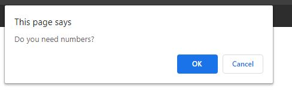

# Javascript Password Generator

## Find my deployed project at: https://mrtavit.github.io/js-password-generator/

This project is a simple password generator using only Javascript. This version of the site will use prompt/alert/confirm textboxes in order to convey all information.

The expected result is that the user will receive a randomly generated password. This password will consist of at least 1 character per character type the user chooses, as well as 1 lower case character. The remainder of the password is randomly generated with characters of the chosen types.

 When the page is opened the user will be prompted with a greeting and asked how long the password they need to be generated will be.

If an incorrect input is entered the user will be shown an error.

 After entering an integer for the password length there will be a series of prompts asking the user whether or not their password will need certain characters from a selection:
* Capital Letters (A-Z)
* Numbers (1-9)
* Special Characters (!"#$%&'()*+,-./:;<=>?@[\]^_`{|}~)

Finally, the page will generate a password with the user given choices and output the result through an alert.

An extra password alert will show if an invalid entry is entered before a valid one. This will show the password as 'undefined'.

